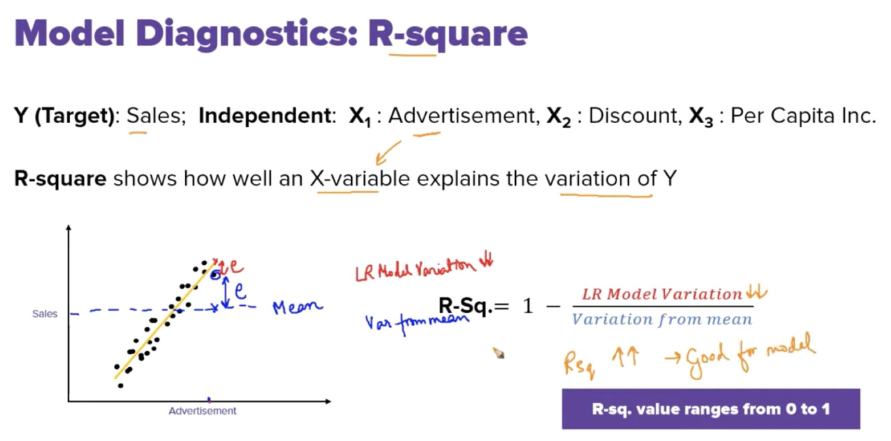

# Model Diagnostic

### •	It defines Statistically significance of model 
### •	How dependent variable is impacted by certain features
### •	Which features to choose and leave

## Some Evaluation metrics
## 1.	P-value: 

### •	It gives probability of target i.e. dependent variable and features i.e. independent variable are not linearly correlated.
### •	It is indicator is not absolute measure .
### •	p>0.05: Do not consider as a candidate for linear regression.
### •	p<0.05: Can consider a candidate for linear regression.   

## 2.	R square:
### •	It shows how well a feature explains the variation of label i.e., dependent variable.
### •	R-square>0.7 is good score for feature we can add 
### •	Works well we check features individually.
   
 

## Problems with R square: 
•	When we combine two or more features R-square value is always greater and then it can lead to overfitting

## Adjusted R square: 
### •	It penalizes addition of features

## Variation Inflation Factor
### •	In Regression we do not want Multi collinearity
### •	Helps to determine multi collinearity.
### •	VIF high worst there is multi collinearity VIF>8
### •	VIF low best there is multi collinearity VIF<8 usually (5-10) 

## Multiple Linear Regression

 

## Assumptions in Linear Regresssion:
### •	Linear relation

### •	Little or no Multi colinearity

### •	Mean of errors should be zero and should follow Normal Distribution

### •	HomoScedacity:There should be no pattern observed between errors in x variables

 
 
 
 

